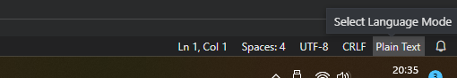

# BraneScript Syntax Highlighting

This repository contains code that implements syntax highlighting for the BraneScript domain-specific language, part of the [EPI Project](https://github.com/epi-project). Currently, the only system implementing it is [BRANE](https://github.com/epi-project/brane), which is a workflow execution system for use in the medical domain. It, and BraneScript, are designed as part of the [Enabling Personalized Interventions project](https://enablingpersonalizedinterventions.nl).

BraneScript itself is a script-like language with which one can define workflows. These workflows are high-level control flow specifications of tasks, or functions, which are bunled in packages within the BRANE ecosystem. To support this, the language has the familiar basic concepts (variables, classes, functions, if-statements, while-loop, for-loops), as well as some that are specialized towards workflow execution (parallel-statements, package imports, on-structs).


## Features

This extension adds basic syntax highlighting for keywords, variables, comments and constants. In addition, it provides limited additional information to the editor such that it can comment large blocks, provide auto-matching for brackets and quotes and properly highlights them. However, this extension does not add a language server, so any context-dependent highlighting or suggestions are not provided at this time.

  
_Example of the BraneScript syntax highlighter using the [Panda Theme](https://marketplace.visualstudio.com/items?itemName=tinkertrain.theme-panda). The code is a snippet from [this repository](https://github.com/epi-project/brane-disaster-tweets-example)._

In the future, adding a language server would be optimal. Moreover, syntax highlighting for BraneScript's sister language -Bakery- is required too.


## Installation
To install the extension in your local setup, you can either download the extension via the marketplace (recommended), download the package VSIX file from the repository, or compile the VSIX file yourself.

### Marketplace
To download the extension from the marketplace, simply go the `Extensions` tab in Visual Studio Code.

Then, search for "branescript" and click on `Install` to install the latest version.

  
_Menu to install another extension from the marketplace, for illustration purposes._

This method is recommended because you can also automatically receive updates.


### Downloading
You can also choose to download a specific version of the extension from its [repository](https://github.com/epi-project/brane-syntax-highlighting/releases). Simply select the desired release, and then download the `.vsix` file to someplace on your machine (where does not matter, as long as you can find it).

Then, you can install the extension by going to the `Extensions` tab in Visual Studio Code and then clicing the three-dot menu at the top of the middle panel. From there, you can select `Install from VSIX...`.

  
_Menu to install a local .vsix file._

Navigate to the `.vsix` file you downloaded, and click `Install`.

  
_Browsing to a .vsix file on Linux._

The extension should be installed once this operation completes.


### Compilation
Before you begin, you should first install [`npm`](https://docs.npmjs.com/downloading-and-installing-node-js-and-npm) on your machine. Once done, you can install the [`vsce`](https://github.com/microsoft/vscode-vsce) package we will use to build the extension:
```bash
sudo npm install -g vsce
```

Then you can clone the [repository](https://github.com/epi-project/brane-syntax-highlighting):
```bash
git clone https://github.com/epi-project/brane-syntax-highlighting
cd ./brane-syntax-highlighting
```

With `vsce` installed and the repository cloned, you can compile the extension by running:
```bash
vsce package
```

This will generate the package `.vsix` file for us.

To install the extension, you can follow the steps taken for [downloading](#downloading) the extension, except that you already have a `.vsix` file ready (so no need to download it from the repository).


## Usage
To use the extension, simply create a new file.

  
_Steps to create a new file._

If you give the new file a `.bs`, `.bscript` or `.branescript` extension, the extension should be enabled on this file automatically. If not, you can manually select it in the lower-right corner of the window.

  
_The button to open the language selection menu._

  
_The menu to select the BraneScript language for this file._

You can do the same trick on existing files to apply BraneScript's syntax highlighting.

## Release Notes
A brief overview of each release is given here. For more details, check the [CHANGELOG.md](https://gitlab.com/eflint/tools/syntax-highlighting-vscode/-/blob/main/CHANGELOG.md) file.

### 1.0.0
Initial release of the extension.
